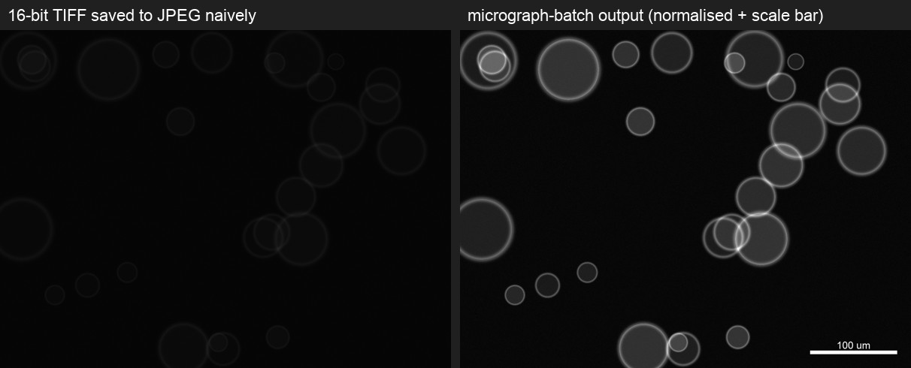

# micrograph-batch

[](https://github.com/ArGoN-SpUTTerING/micrograph-batch/actions/workflows/tests.yml)
[](https://doi.org/10.5281/zenodo.21396630)
[](LICENSE)
[](pyproject.toml)

**CSV-driven batch processing for microscopy images** — convert raw 16-bit TIFFs into publication-ready JPEGs with calibrated scale bars, reproducibly, hundreds at a time.



Built during my PhD to process the optical-microscopy datasets behind three thesis chapters — thousands of frames across ~30 experimental series — after doing it by hand in ImageJ stopped scaling.

## The problem it solves

Scientific cameras write 12/16-bit TIFFs whose pixel values occupy a narrow band of the sensor range. Saved to JPEG naively they render almost black (left image above). Preparing them for a paper or thesis means, for *every* frame:

1. normalise the bit depth,
2. crop to the region of interest,
3. tune brightness/contrast,
4. draw a scale bar calibrated to the objective's µm/px,
5. export as JPEG with a sensible name.

Doing this by hand is slow and — worse — **irreproducible**: three months later you cannot say what crop or contrast a figure used. `micrograph-batch` moves every decision into a CSV you can read, diff, and re-run.

## How it works

One CSV row per image; blank cells fall back to defaults. The config is the *record* of how each figure was produced:

```csv
enabled,filename,output_name,um_per_px,bar_um,crop_left,crop_top,crop_right,crop_bottom,brightness,contrast,...
TRUE,droplets_16bit.tif,droplets_scalebar.jpg,0.325,100,,,,,1.0,1.1,...
TRUE,texture_t0_16bit.tif,texture_t0_cropped.jpg,0.325,50,200,150,1400,1050,1.05,1.2,...
```

```bash
micrograph-batch --config demo_config.csv --input-dir input --output-dir output
```

```
Saved: output/droplets_scalebar.jpg
Saved: output/texture_t0_cropped.jpg
Saved: output/texture_t1_cropped.jpg
------------------------------------------------------------
Finished. Processed=3, Failed=0
------------------------------------------------------------
```

A failed row is reported with its CSV row number and does not stop the batch.

## Features

- **16-bit → 8-bit normalisation** — min–max stretch so narrow-band scientific TIFFs become visible JPEGs
- **Calibrated scale bars** — specify `um_per_px` (objective calibration) and `bar_um`; position, thickness, colour, and optional text label per image
- **Crop, brightness, contrast** — per image, recorded in the CSV
- **Visual crop mode** — a Tkinter GUI to drag crop boxes over each image and write the coordinates back into the CSV (`--visual-crop`), with keyboard nudging for pixel-perfect alignment
- **Starter config generation** — `--init-config` scans a folder (recursively) and writes a pre-filled CSV
- **Safe re-runs** — existing outputs are skipped unless `--overwrite`; `--init-config` refuses to clobber a config without `--overwrite-config`
- **No heavy dependencies** — Pillow only (numpy is used just to generate the synthetic demo images)

## Install

```bash
pip install git+https://github.com/ArGoN-SpUTTerING/micrograph-batch.git
# or, from a clone:
pip install -e .
```

Python ≥ 3.10. The visual crop GUI additionally needs Tkinter (bundled with most Python installers).

## Quickstart

```bash
# 1. Generate a starter config by scanning your image folder
micrograph-batch --init-config --input-dir my_images --config batch.csv

# 2. Fill in um_per_px / bar_um / crops in any spreadsheet editor
#    ...or drag crop boxes visually:
micrograph-batch --visual-crop --config batch.csv --input-dir my_images

# 3. Run the batch
micrograph-batch --config batch.csv --input-dir my_images --output-dir processed
```

Try it without your own data — the repo ships a synthetic demo (simulated emulsion droplets and birefringent textures, generated with numpy so no research data is included):

```bash
cd examples
python make_demo_images.py
micrograph-batch --config demo_config.csv --input-dir input --output-dir output
```

## Config reference

| Column | Meaning | Default |
|---|---|---|
| `enabled` | `TRUE`/`FALSE` — skip a row without deleting it | `TRUE` |
| `filename` | Path relative to `--input-dir` (or absolute) | required |
| `output_name` | Output path relative to `--output-dir`; blank keeps the input's relative path | mirrors input |
| `um_per_px` | Pixel calibration of the objective | none |
| `bar_um` | Scale-bar length in µm (requires `um_per_px`) | none |
| `crop_left/top/right/bottom` | Crop box in original pixels — all four or none | no crop |
| `brightness` / `contrast` | Multiplicative enhancement factors | `1.0` |
| `bar_position` | `bottom-right`, `bottom-left`, `top-right`, `top-left` | `bottom-right` |
| `bar_margin` / `bar_thickness` | Bar geometry in px | `40` / `8` |
| `bar_color` / `label_color` | Any Pillow colour name or hex | `white` |
| `show_label` / `bar_label` | Draw a text label; blank label auto-formats from `bar_um` (e.g. `100 um`) | off |
| `label_font_size` | Label size in pt | `24` |
| `jpeg_quality` | 1–100 | `95` |

## Design notes

- **The CSV is the single source of truth.** The GUI does not process images; it only edits the config. Anything the batch does is reproducible from the file alone.
- **Fail per row, not per batch.** An unreadable frame or an over-wide scale bar reports its row number and the batch continues.
- **Validation up front.** Config errors (partial crop boxes, missing calibration, unknown bar positions) fail with the offending CSV row number before any image is touched.

## Development

```bash
pip install -e ".[dev]"
pytest
```

## License

[MIT](LICENSE)
